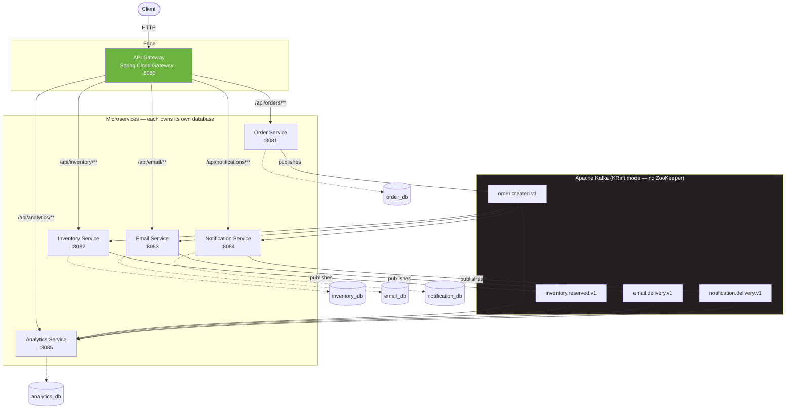
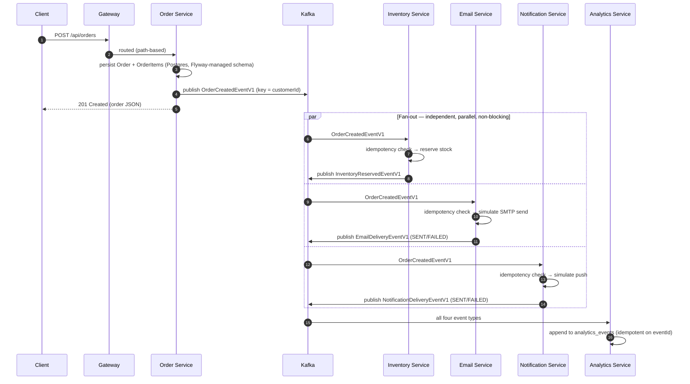
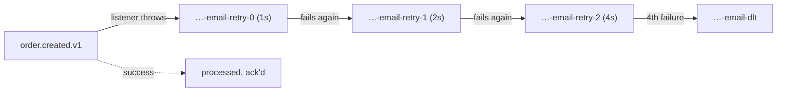
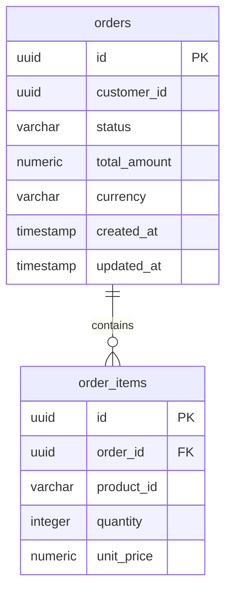

# Event-Driven Order Processing Platform

> A production-style, event-driven microservices backend built on Apache Kafka and Spring Boot — modeling how order pipelines are actually architected at companies like Uber, Netflix, and Shopify, at a scale a single engineer can build, run, and explain end to end.

[](https://openjdk.org/projects/jdk/25/)
[](https://spring.io/projects/spring-boot)
[](https://spring.io/projects/spring-cloud-gateway)
[](https://kafka.apache.org/)
[](https://www.postgresql.org/)
[](https://www.docker.com/)
[](https://flywaydb.org/)
[](LICENSE)

---

## Table of Contents

- [Project Overview](#project-overview)
- [Architecture Diagram](#architecture-diagram)
- [High-Level Event Flow](#high-level-event-flow)
- [Project Features](#project-features)
- [Microservice Breakdown](#microservice-breakdown)
- [Technology Stack](#technology-stack)
- [Project Structure](#project-structure)
- [Kafka Topics](#kafka-topics)
- [Database Design](#database-design)
- [API Endpoints](#api-endpoints)
- [Docker Deployment](#docker-deployment)
- [How to Run](#how-to-run)
- [Verification Steps](#verification-steps)
- [Example Requests](#example-requests)
- [Design Decisions](#design-decisions)
- [Distributed Systems Concepts Used](#distributed-systems-concepts-used)
- [Challenges Faced During Development](#challenges-faced-during-development)
- [Known Limitations](#known-limitations)
- [Future Improvements](#future-improvements)
- [Resume Highlights](#resume-highlights)
- [Interview Questions and Answers](#interview-questions-and-answers)
- [Lessons Learned](#lessons-learned)
- [Author](#author)
- [License](#license)

---

## Project Overview

This is an order-processing backend built around one architectural bet: **services should never call each other directly.** Every cross-service interaction — reserving stock, sending a confirmation email, pushing a notification, recording a metric — happens by publishing and consuming events on Apache Kafka, not by one service holding an HTTP client for another.

The project intentionally trades the simplicity of a monolith or a REST-chained set of services for the properties that matter once a system has more than one consumer per event: independent failure domains, independent scaling, independent deployability, and the ability to add a sixth consumer to "a customer placed an order" without touching the five that already exist.

It is **not** dressed up to look more finished than it is. The README below is explicit about what's implemented, what's partially implemented, and what's still future work — most notably the Outbox Pattern (Order Service currently has a real dual-write gap between its database commit and its Kafka publish) and Saga-style compensation (Inventory Service currently has no way to tell Order Service "actually, cancel that — we're out of stock").

**Who this is for:** anyone evaluating distributed-systems/backend engineering skill — the deliberate engineering choices below (and the bugs found and fixed while building it, documented honestly in [Challenges Faced](#challenges-faced-during-development)) are the actual point of the project, not the six services themselves.

---

## Architecture Diagram



Order Service is the only producer of `order.created.v1` — it is also the **only service that ever talks to a downstream service that isn't its own database.** Inventory, Email, and Notification are siblings, not a pipeline: all three subscribe to the same topic independently and fail independently of each other. Analytics is the only service subscribed to every topic in the system.

---

## High-Level Event Flow



The client gets a response the instant the order is durably persisted and the event is acknowledged by the Kafka broker — typically tens of milliseconds. Everything in the `par` block happens **after** the client already has its `201 Created`. This is the entire point of the architecture: the customer-facing latency is decoupled from the slowest thing that happens as a side effect of their order.

---

## Project Features

| Feature | Status |
|---|---|
| Event-driven architecture (Kafka as the only inter-service channel) | ✅ Implemented |
| API Gateway with path-based routing | ✅ Implemented |
| Order creation REST API with Bean Validation | ✅ Implemented |
| Kafka producers (keyed, `acks=all`, idempotent producer) | ✅ Implemented |
| Kafka consumers (`@KafkaListener`, manual + framework-managed offsets) | ✅ Implemented |
| Database-per-service (5 isolated PostgreSQL instances) | ✅ Implemented |
| Flyway-versioned schema migrations, one history per service | ✅ Implemented |
| Inventory reservation against seeded stock | ✅ Implemented |
| Idempotent consumers (dedupe table keyed on event ID) | ✅ Implemented |
| Kafka replay support (`auto-offset-reset=earliest` + fresh consumer groups) | ✅ Implemented |
| Non-blocking Retry Topics (`@RetryableTopic`, exponential backoff) | ✅ Implemented (Email, Notification) |
| Dead Letter Topics with a dedicated `@DltHandler` | ✅ Implemented (Email, Notification) |
| Email send simulation with controllable failure injection | ✅ Implemented |
| Push notification simulation with controllable failure injection | ✅ Implemented |
| Analytics aggregation across 4 event types | ✅ Implemented |
| Fully Dockerized deployment (multi-stage builds, healthchecks) | ✅ Implemented |
| Kafka UI for topic/partition/consumer-group inspection | ✅ Implemented |
| Actuator health endpoints on every service | ✅ Implemented |
| OpenAPI/Swagger UI on every REST-exposing service | ✅ Implemented |
| Independent deployability (each service has its own image, build, lifecycle) | ✅ Implemented |
| Transactional outbox for the order-create → publish dual write | ⚠️ Not implemented — see [Known Limitations](#known-limitations) |
| Retry topics / DLT on Inventory Service | ⚠️ Not implemented — see [Known Limitations](#known-limitations) |
| Saga / compensating transactions for insufficient-stock failures | ⚠️ Not implemented — see [Known Limitations](#known-limitations) |
| Authentication / authorization | ❌ Not implemented |
| Distributed tracing / correlation IDs | ❌ Not implemented |
| Automated test suite | ❌ Not implemented (manual, documented verification only) |

---

## Microservice Breakdown

### API Gateway
Single entry point for all external traffic. Built on Spring Cloud Gateway (WebFlux/Netty — reactive, non-blocking), not the servlet stack the other five services use. Routes by path prefix to the correct downstream service and exposes nothing else: no business logic, no database, no Kafka involvement. This is where authentication and rate limiting would attach in a hardened version — see [Future Improvements](#future-improvements).

### Order Service
The only producer in the system. Exposes `POST /api/orders` and `GET /api/orders/{id}`, persists the order and its line items in `order_db` via Spring Data JPA, then publishes `OrderCreatedEventV1` keyed by `customerId`. Owns the `OrderCreatedEventV1` contract — every other service keeps its own local copy (see [Design Decisions](#design-decisions) for why).

### Inventory Service
Consumes `OrderCreatedEventV1`, checks an idempotency table before touching anything, decrements seeded stock per product, records the reservation, and publishes `InventoryReservedEventV1`. Exposes `GET /api/inventory/{productId}` for current stock. This is the service where idempotency stopped being theoretical — see [Distributed Systems Concepts Used](#distributed-systems-concepts-used).

### Email Service
Consumes `OrderCreatedEventV1` and simulates sending a confirmation email. Wraps its listener in `@RetryableTopic`: a failed send is retried three times on a separate, non-blocking retry topic before landing on a dedicated Dead Letter Topic. Publishes `EmailDeliveryEventV1` with the final outcome (`SENT` or `FAILED`) after every attempt sequence resolves. Exposes `GET /api/email/orders/{orderId}`.

### Notification Service
Structurally identical to Email Service — same idempotency pattern, same non-blocking retry/DLT pattern, same completion-event pattern — for simulated push notifications instead of email. The repetition is deliberate: once a pattern is proven correct, the right move is to apply it consistently, not redesign it per service. Exposes `GET /api/notifications/orders/{orderId}`.

### Analytics Service
The only service subscribed to all four topics. Stores every event as an immutable fact row (`analytics_events`) and computes every metric on read via SQL aggregation rather than maintaining separately-updated counters — see [Design Decisions](#design-decisions) for the reasoning. On first boot, a fresh consumer group with `auto-offset-reset=earliest` replays the entire history of every topic, which is also the project's live demonstration of Kafka's replayability. Exposes `GET /api/analytics/summary` and `GET /api/analytics/orders-per-hour`.

---

## Technology Stack

| Layer | Technology | Notes |
|---|---|---|
| Language | Java 25 (LTS) | Released Sept 2025; first Boot version with native first-class support |
| Framework | Spring Boot 4.1.0 / Spring Framework 7 | Modular auto-configuration (see Challenges) |
| API Gateway | Spring Cloud Gateway (Spring Cloud 2025.1.2, WebFlux-based) | Reactive, Netty-backed |
| Messaging | Apache Kafka 4.3.1 (KRaft mode) | No ZooKeeper — KRaft is the only mode as of Kafka 4.x |
| Kafka client | Spring Kafka 4.1.0 | `@KafkaListener`, `@RetryableTopic`, `KafkaTemplate` |
| Persistence | Spring Data JPA + Hibernate 7 | One `EntityManagerFactory` per service |
| Database | PostgreSQL 17 (×5 isolated instances) | One container, one database, one service |
| Schema migrations | Flyway (`spring-boot-starter-flyway` + `flyway-database-postgresql`) | Versioned SQL, no manual DDL |
| API docs | springdoc-openapi 3.0.3 (Swagger UI) | Per-service, not aggregated at the Gateway |
| Build | Maven, multi-stage Docker builds | `maven:3.9-eclipse-temurin-25-alpine` → `eclipse-temurin:25-jre-alpine` |
| Containerization | Docker Compose | 13 containers: 6 services + Kafka + Kafka UI + 5 Postgres instances |
| Observability (basic) | Spring Boot Actuator | `/actuator/health` on every service, used as the Docker healthcheck |
| Boilerplate reduction | Lombok 1.18.46 | Restricted to entities only — see [Design Decisions](#design-decisions) |

---

## Project Structure

```text
event-driven-order-platform/
├── docker-compose.yml
├── .env                          # not committed — see .env.example
├── README.md
│
├── gateway/
│   ├── Dockerfile
│   ├── pom.xml
│   └── src/main/
│       ├── java/com/orderplatform/gateway/
│       │   └── GatewayApplication.java
│       └── resources/application.yml
│
├── order-service/
│   ├── Dockerfile
│   ├── pom.xml
│   └── src/main/
│       ├── java/com/orderplatform/orderservice/
│       │   ├── OrderServiceApplication.java
│       │   ├── domain/          # Order, OrderItem, OrderStatus
│       │   ├── api/             # REST controller, DTOs, exception handler
│       │   ├── repository/      # Spring Data JPA repositories
│       │   ├── service/         # business logic + transactional boundary
│       │   ├── event/           # OrderCreatedEventV1, KafkaTemplate wrapper
│       │   └── config/          # NewTopic bean
│       └── resources/
│           ├── application.yml
│           └── db/migration/    # Flyway V1__create_orders_schema.sql
│
├── inventory-service/           # mirrors order-service's package layout
├── email-service/                # + @RetryableTopic, @DltHandler
├── notification-service/         # + @RetryableTopic, @DltHandler
└── analytics-service/            # 4 local event-record copies, manual JSON parsing
```

Every service is a self-contained Maven module with its own `pom.xml`, its own `Dockerfile`, its own Flyway migration directory, and — deliberately — its **own local copy** of any event contract it consumes (no shared `event-contracts` JAR). See [Design Decisions](#design-decisions).

---

## Kafka Topics

| Topic | Producer | Consumer(s) | Partitions | Key | Purpose |
|---|---|---|---|---|---|
| `order.created.v1` | Order Service | Inventory, Email, Notification, Analytics | 3 | `customerId` | Fan-out trigger for everything downstream of order creation |
| `inventory.reserved.v1` | Inventory Service | Analytics | 3 | `orderId` | Confirms stock was reserved for an order |
| `email.delivery.v1` | Email Service | Analytics | 3 | `orderId` | Final outcome (SENT/FAILED) of an email send attempt sequence |
| `notification.delivery.v1` | Notification Service | Analytics | 3 | `orderId` | Final outcome (SENT/FAILED) of a push attempt sequence |

### Retry & Dead Letter Topics

Email and Notification Service each wrap their `order.created.v1` listener in `@RetryableTopic`. Because both services listen to the *same* main topic, the framework's default retry/DLT naming (derived purely from the main topic name) would have made both services create identically-named topics — a real collision caught and fixed during development (see [Challenges Faced](#challenges-faced-during-development)). Each service now has an explicit, disambiguated suffix:



| Service | Retry topics | DLT topic | Attempts | Backoff |
|---|---|---|---|---|
| Email Service | `order.created.v1-email-retry-0/1/2` | `order.created.v1-email-dlt` | 4 (1 initial + 3 retries) | 1s → 2s → 4s (exponential, ×2, capped at 10s) |
| Notification Service | `order.created.v1-notification-retry-0/1/2` | `order.created.v1-notification-dlt` | 4 | 1s → 2s → 4s |

Retries are **non-blocking**: a failed message is republished to a separate topic with a delay header rather than retried in a sleep loop on the main consumer thread, so one customer's transient email failure never delays anyone else's order in the same partition.

---

## Database Design

Each service owns exactly one PostgreSQL database. No service has read or write access to another service's schema — every cross-service fact travels through Kafka, never through a shared table or a synchronous query.

### `order_db`



### `inventory_db`

| Table | Purpose |
|---|---|
| `products` | Seeded stock per product (`product_id`, `quantity_available`, with a `CHECK (quantity_available >= 0)` constraint) |
| `inventory_reservations` | One row per product per order reservation, for audit |
| `processed_events` | Idempotency dedupe table, PK = the event's own `eventId` |

### `email_db` / `notification_db`

Structurally identical to each other:

| Table | Purpose |
|---|---|
| `email_log` / `notification_log` | One row per send attempt outcome (`SENT`/`FAILED`) |
| `processed_events` | Idempotency dedupe table |

### `analytics_db`

A single append-only fact table rather than the `processed_events` + business-table split used elsewhere:

| Column | Purpose |
|---|---|
| `id` (PK) | The originating event's own `eventId` — doubles as the idempotency guard |
| `event_type` | `ORDER_CREATED` / `INVENTORY_RESERVED` / `EMAIL_DELIVERY` / `NOTIFICATION_DELIVERY` |
| `order_id`, `customer_id`, `status`, `quantity` | Sparse — populated per event type, `NULL` where not applicable |
| `occurred_at`, `received_at` | Event-time vs. processing-time, kept distinct on purpose |

All six metrics in the [Project Features](#project-features) table are computed by querying this one table — see [Design Decisions](#design-decisions) for why no separate mutable counters exist.

---

## API Endpoints

### Order Service (`:8081`, routed via Gateway at `/api/orders/**`)

| Method | Path | Description |
|---|---|---|
| `POST` | `/api/orders` | Create an order, persist it, publish `OrderCreatedEventV1` |
| `GET` | `/api/orders/{orderId}` | Fetch a single order with its line items |

<details>
<summary><strong>POST /api/orders — request / response / errors</strong></summary>

Request:
```json
{
  "customerId": "11111111-1111-1111-1111-111111111111",
  "items": [
    { "productId": "SKU-001", "quantity": 2, "unitPrice": 499.00 }
  ]
}
```
Success — `201 Created`:
```json
{
  "id": "94a60ebd-1b14-40a7-a8d7-9735caad9f4a",
  "customerId": "11111111-1111-1111-1111-111111111111",
  "status": "CREATED",
  "totalAmount": 998.00,
  "currency": "INR",
  "createdAt": "2026-06-27T11:18:22.416Z",
  "items": [
    { "productId": "SKU-001", "quantity": 2, "unitPrice": 499.00 }
  ]
}
```
Validation failure — `400 Bad Request`:
```json
{
  "timestamp": "2026-06-27T11:20:00.000Z",
  "message": "Validation failed",
  "fieldErrors": { "items": "items must not be empty" }
}
```
</details>

<details>
<summary><strong>GET /api/orders/{orderId} — response / not found</strong></summary>

Success — `200 OK`: same shape as the `POST` response above.

Not found — `404 Not Found`:
```json
{ "timestamp": "2026-06-27T11:21:00.000Z", "message": "Order not found: <id>" }
```
</details>

### Inventory Service (`:8082`, `/api/inventory/**`)

| Method | Path | Description |
|---|---|---|
| `GET` | `/api/inventory/{productId}` | Current available stock for a product |

<details>
<summary><strong>GET /api/inventory/{productId} — response</strong></summary>

```json
{ "productId": "SKU-001", "quantityAvailable": 491 }
```
</details>

### Email Service (`:8083`, `/api/email/**`)

| Method | Path | Description |
|---|---|---|
| `GET` | `/api/email/orders/{orderId}` | Send attempt history/outcome for an order |

<details>
<summary><strong>GET /api/email/orders/{orderId} — response</strong></summary>

```json
[
  {
    "orderId": "94a60ebd-1b14-40a7-a8d7-9735caad9f4a",
    "recipient": "customer-11111111-1111-1111-1111-111111111111@example.com",
    "subject": "Order confirmation: 94a60ebd-1b14-40a7-a8d7-9735caad9f4a",
    "status": "SENT",
    "createdAt": "2026-06-27T11:18:24.000Z"
  }
]
```
</details>

### Notification Service (`:8084`, `/api/notifications/**`)

| Method | Path | Description |
|---|---|---|
| `GET` | `/api/notifications/orders/{orderId}` | Push attempt history/outcome for an order |

<details>
<summary><strong>GET /api/notifications/orders/{orderId} — response</strong></summary>

```json
[
  {
    "orderId": "94a60ebd-1b14-40a7-a8d7-9735caad9f4a",
    "customerId": "11111111-1111-1111-1111-111111111111",
    "channel": "PUSH",
    "message": "Your order 94a60ebd-1b14-40a7-a8d7-9735caad9f4a has been placed.",
    "status": "SENT",
    "createdAt": "2026-06-27T11:18:24.500Z"
  }
]
```
</details>

### Analytics Service (`:8085`, `/api/analytics/**`)

| Method | Path | Description |
|---|---|---|
| `GET` | `/api/analytics/summary` | Total orders, inventory reservations, notifications sent, email success rate, failed events |
| `GET` | `/api/analytics/orders-per-hour` | Hourly order-count buckets |

<details>
<summary><strong>GET /api/analytics/summary — response</strong></summary>

```json
{
  "totalOrders": 15,
  "inventoryReservedEvents": 18,
  "inventoryUnitsReserved": 34,
  "notificationsSent": 14,
  "emailSuccessRate": 0.93,
  "failedEvents": 1
}
```
</details>

<details>
<summary><strong>GET /api/analytics/orders-per-hour — response</strong></summary>

```json
[
  { "hour": "2026-06-27T10:00:00Z", "count": 9 },
  { "hour": "2026-06-27T11:00:00Z", "count": 6 }
]
```
</details>

Every service exposing a REST API also exposes interactive docs at `http://localhost:<port>/swagger-ui.html` and a healthcheck at `http://localhost:<port>/actuator/health`. The Gateway routes only the `/api/**` paths above — Swagger UI and Actuator must be hit directly on each service's own port.

---

## Event Contract Reference

Every event is a versioned, immutable Java record. Each consuming service keeps its own local copy of any contract it depends on rather than importing a shared library — see [Design Decisions](#design-decisions) for why.

### `OrderCreatedEventV1` — published by Order Service to `order.created.v1`

```json
{
  "eventId": "a1b2c3d4-...",
  "occurredAt": "2026-06-27T11:18:22.416Z",
  "orderId": "94a60ebd-1b14-40a7-a8d7-9735caad9f4a",
  "customerId": "11111111-1111-1111-1111-111111111111",
  "totalAmount": 998.00,
  "currency": "INR",
  "items": [
    { "productId": "SKU-001", "quantity": 2, "unitPrice": 499.00 }
  ]
}
```

| Field | Type | Notes |
|---|---|---|
| `eventId` | UUID | Identity of this *event*, distinct from `orderId` — the idempotency key every consumer dedupes on |
| `occurredAt` | Instant | Event-time, set by the producer |
| `orderId` | UUID | The order this event describes |
| `customerId` | UUID | Partition key — guarantees per-customer ordering |
| `items[].productId/quantity/unitPrice` | — | Enough for Inventory to reserve stock without a callback to Order Service |

### `InventoryReservedEventV1` — published by Inventory Service to `inventory.reserved.v1`

```json
{
  "eventId": "b2c3d4e5-...",
  "occurredAt": "2026-06-27T11:18:23.100Z",
  "orderId": "94a60ebd-1b14-40a7-a8d7-9735caad9f4a",
  "items": [ { "productId": "SKU-001", "quantity": 2 } ]
}
```

### `EmailDeliveryEventV1` — published by Email Service to `email.delivery.v1`

```json
{
  "eventId": "c3d4e5f6-...",
  "occurredAt": "2026-06-27T11:18:24.000Z",
  "orderId": "94a60ebd-1b14-40a7-a8d7-9735caad9f4a",
  "customerId": "11111111-1111-1111-1111-111111111111",
  "status": "SENT",
  "recipient": "customer-11111111-1111-1111-1111-111111111111@example.com"
}
```
`status` is only ever published as the *final* outcome of an entire attempt sequence (`SENT` from the happy path, `FAILED` only after the Dead Letter Topic is reached) — never from a mid-retry transient failure, so Analytics never sees a premature `FAILED` for an order that goes on to succeed on retry.

### `NotificationDeliveryEventV1` — published by Notification Service to `notification.delivery.v1`

```json
{
  "eventId": "d4e5f6a7-...",
  "occurredAt": "2026-06-27T11:18:24.500Z",
  "orderId": "94a60ebd-1b14-40a7-a8d7-9735caad9f4a",
  "customerId": "11111111-1111-1111-1111-111111111111",
  "status": "SENT",
  "channel": "PUSH"
}
```

---

## Docker Deployment

The entire platform is 13 containers on one user-defined bridge network (`order-platform-network`), brought up with a single `docker compose up -d --build`:

| Container | Image | Host Port |
|---|---|---|
| `gateway` | built locally | 8080 |
| `order-service` | built locally | 8081 |
| `inventory-service` | built locally | 8082 |
| `email-service` | built locally | 8083 |
| `notification-service` | built locally | 8084 |
| `analytics-service` | built locally | 8085 |
| `kafka` | `apache/kafka:4.3.1` | 9092 |
| `kafka-ui` | `provectuslabs/kafka-ui:latest` | 8090 |
| `postgres-order` | `postgres:17-alpine` | 5433 |
| `postgres-inventory` | `postgres:17-alpine` | 5434 |
| `postgres-notification` | `postgres:17-alpine` | 5435 |
| `postgres-email` | `postgres:17-alpine` | 5437 |
| `postgres-analytics` | `postgres:17-alpine` | 5436 |

**Why containers talk to each other by service name, not `localhost`:** Docker Compose's default bridge network gives every container a DNS entry matching its service name. `order-service` resolves `postgres-order` and `kafka` by name on the internal network; the host-mapped ports above exist purely so *you*, from PowerShell, can reach into containers directly for verification. Kafka itself runs **two listeners** for exactly this reason — `PLAINTEXT://kafka:19092` for container-to-container traffic, `PLAINTEXT_HOST://localhost:9092` for host-machine tools.

Every application image is a multi-stage build: a `maven:3.9-eclipse-temurin-25-alpine` stage compiles the jar, and a slim `eclipse-temurin:25-jre-alpine` stage runs it as a non-root `spring` user, with an `actuator/health`-based `HEALTHCHECK` baked into the image — `docker compose ps` reports real application health, not just "container didn't crash."

---

## Local Development Reference

### Environment variables (`.env`, never committed — see `.env.example`)

| Variable | Purpose |
|---|---|
| `POSTGRES_USER` | Shared admin username across all 5 Postgres containers (dev convenience — they're physically separate databases regardless) |
| `POSTGRES_PASSWORD` | Shared admin password — change this before ever exposing any port publicly |
| `KAFKA_CLUSTER_ID` | Generated once via `kafka-storage.sh random-uuid`, required once any KRaft config is customized beyond defaults |
| `EMAIL_ALWAYS_FAIL_CUSTOMER_ID` | Optional — set to a specific `customerId` to deterministically force that customer's emails through the full retry → DLT path, for testing |
| `NOTIFICATION_ALWAYS_FAIL_CUSTOMER_ID` | Same, for Notification Service |

### Port map

| Port | Service |
|---|---|
| 8080 | Gateway |
| 8081 | Order Service |
| 8082 | Inventory Service |
| 8083 | Email Service |
| 8084 | Notification Service |
| 8085 | Analytics Service |
| 8090 | Kafka UI |
| 9092 | Kafka (host-facing listener) |
| 5433–5437 | Postgres ×5 (order, inventory, notification, email, analytics, in that container-creation order) |

### Cheatsheet

```powershell
# Tail one service's logs
docker compose logs <service> --tail 50 -f

# Rebuild one service after a code change
docker compose build <service> --no-cache
docker compose up -d <service>

# List every Kafka topic, including auto-created retry/DLT topics
docker exec -it kafka /opt/kafka/bin/kafka-topics.sh --bootstrap-server localhost:9092 --list

# Inspect a consumer group's lag/offsets per partition
docker exec -it kafka /opt/kafka/bin/kafka-consumer-groups.sh --bootstrap-server localhost:9092 --describe --group <service-name>

# Tear everything down, including volumes (full reset)
docker compose down -v
```

---

## How to Run

**Prerequisites:** Docker Desktop (Windows 11 + WSL2 backend recommended), ~4GB free RAM for the container set.

```powershell
git clone https://github.com/<your-username>/event-driven-order-platform.git
cd event-driven-order-platform

# Copy the example env file and fill in real values
Copy-Item .env.example .env
# Edit .env: set POSTGRES_PASSWORD to something real, generate a Kafka cluster ID:
docker run --rm apache/kafka:4.3.1 /opt/kafka/bin/kafka-storage.sh random-uuid
# paste that output into .env as KAFKA_CLUSTER_ID

# Build and start everything
docker compose up -d --build

# Watch it come healthy (takes ~60-90s on first run, mostly Maven dependency resolution)
docker compose ps
```

First time to a successful `POST /api/orders` round trip: under 5 minutes once Docker Desktop is already running, almost all of it spent on the first `--build` pulling base images and resolving Maven dependencies.

---

## Verification Steps

```powershell
# 1. Every container should report (healthy)
docker compose ps

# 2. Gateway is alive and routing
Invoke-RestMethod http://localhost:8080/actuator/health

# 3. Create an order end-to-end through the Gateway
$body = @{
  customerId = [guid]::NewGuid().ToString()
  items = @(@{ productId = "SKU-001"; quantity = 2; unitPrice = 499.00 })
} | ConvertTo-Json -Depth 5

$order = Invoke-RestMethod -Uri http://localhost:8080/api/orders -Method Post -Body $body -ContentType "application/json"
$order

# 4. Confirm the fan-out landed everywhere
Start-Sleep -Seconds 3
Invoke-RestMethod "http://localhost:8082/api/inventory/SKU-001"
Invoke-RestMethod "http://localhost:8083/api/email/orders/$($order.id)"
Invoke-RestMethod "http://localhost:8084/api/notifications/orders/$($order.id)"
Invoke-RestMethod "http://localhost:8085/api/analytics/summary"

# 5. Inspect the raw Kafka event (proves the contract, not just the side effect)
docker exec -it kafka /opt/kafka/bin/kafka-console-consumer.sh `
  --bootstrap-server localhost:9092 --topic order.created.v1 `
  --property print.key=true --from-beginning --max-messages 1
```

**Replay proof (the test that actually matters for an idempotency claim):**

```powershell
docker compose stop inventory-service
docker exec -it postgres-inventory psql -U <user> -d inventory_db -c `
  "DELETE FROM processed_events; DELETE FROM inventory_reservations; UPDATE products SET quantity_available = 500;"
docker exec -it kafka /opt/kafka/bin/kafka-consumer-groups.sh --bootstrap-server localhost:9092 `
  --group inventory-service --topic order.created.v1 --reset-offsets --to-earliest --execute
docker compose start inventory-service
# Stock should land back at exactly (500 - sum of every order ever placed), not lower —
# proving the idempotency table, not luck, prevented double-decrementing on replay.
```

---

## Example Requests

**Create an order:**
```bash
curl -X POST http://localhost:8080/api/orders \
  -H "Content-Type: application/json" \
  -d '{
    "customerId": "11111111-1111-1111-1111-111111111111",
    "items": [
      { "productId": "SKU-001", "quantity": 2, "unitPrice": 499.00 },
      { "productId": "SKU-002", "quantity": 1, "unitPrice": 1299.00 }
    ]
  }'
```

**Response:**
```json
{
  "id": "94a60ebd-1b14-40a7-a8d7-9735caad9f4a",
  "customerId": "11111111-1111-1111-1111-111111111111",
  "status": "CREATED",
  "totalAmount": 2297.00,
  "currency": "INR",
  "createdAt": "2026-06-27T11:18:22.416Z",
  "items": [
    { "productId": "SKU-001", "quantity": 2, "unitPrice": 499.00 },
    { "productId": "SKU-002", "quantity": 1, "unitPrice": 1299.00 }
  ]
}
```

**Fetch analytics summary:**
```bash
curl http://localhost:8085/api/analytics/summary
```
```json
{
  "totalOrders": 15,
  "inventoryReservedEvents": 18,
  "inventoryUnitsReserved": 34,
  "notificationsSent": 14,
  "emailSuccessRate": 0.93,
  "failedEvents": 1
}
```


## Design Decisions

**Why Kafka instead of REST chaining between services.** A synchronous chain (Order → Inventory → Email → Notification, each waiting on the last) ties the customer-facing latency to the slowest, least-time-sensitive step in the chain, and turns "Email Service is briefly down" into "orders can't be placed." Publishing an event and walking away decouples those failure domains completely — Inventory, Email, and Notification can each be down independently with zero effect on order creation.

**Why every service owns its own database.** The alternative — a shared database — silently re-couples services that Kafka was supposed to decouple: a schema change in one service's table becomes a breaking change for every other service reading it. Database-per-service is what makes "deploy Inventory Service without coordinating with anyone else" actually true rather than aspirational.

**Why every consuming service keeps its own local copy of the event contract, not a shared library.** A shared `event-contracts.jar` would mean every consumer has to bump its dependency version (and redeploy) the moment the producer changes the contract — exactly the coupling EDA is meant to remove. The cost is duplication (the same `OrderCreatedEventV1` shape exists in four packages); the benefit is that each service's deploy is genuinely independent. This is also why consumers explicitly disable Kafka's JSON type-header trust (`spring.json.use.type.headers=false`) — a consumer should never deserialize based on the *producer's* Java class name, only its own.

**Why idempotent consumers, not "exactly-once."** Kafka's delivery guarantee here is at-least-once: a crash, a slow offset commit, or a rebalance can cause the same message to be redelivered. Rather than chase full exactly-once semantics (which needs transactional producers *and* consumers across the read-process-write boundary — a meaningfully bigger commitment), every consumer keeps a dedupe table keyed on the event's own ID and treats "have I already done this" as a question to answer in the database, not assume from the broker.

**Why non-blocking Retry Topics instead of retrying inline.** A `try { } catch { Thread.sleep(); retry; }` loop on the main listener thread stalls the entire partition — every order behind a failing one waits. `@RetryableTopic` republishes a failed message to a separate topic with a backoff delay instead, so the main consumer is immediately free to process the next message.

**Why Analytics computes metrics on read instead of maintaining counters.** Materialized counters (e.g., an `order_count` column incremented on every event) need careful concurrent-update handling and silently drift if the increment logic ever has a bug — and once they drift, there's no way back to "what actually happened" without replaying from source. An append-only fact table plus SQL aggregation at query time means the metrics are always a direct, recomputable function of the raw events; if the definition of a metric changes, you fix the query, not a years-old running total.

**Why Lombok is restricted to JPA entities only.** Records already give immutable DTOs and event payloads for free, with no annotation processing involved; reserving Lombok for the one place it earns its keep (mutable JPA entities needing getters/setters/no-args constructors) keeps the dependency's footprint — and its build-tooling risk, which turned out to be real, see [Challenges Faced](#challenges-faced-during-development) — as small as possible.

**Why Java 25 / Spring Boot 4 for a project started in mid-2026, instead of the "safer" 3.x line.** Spring Boot 3.5 reaches end of support within days of this project starting; building new on a framework version already approaching end-of-life isn't actually the conservative choice for something meant to demonstrate current engineering judgment. The migration cost was real (documented at length below) — but it was paid once, deliberately, with eyes open.

---

## Distributed Systems Concepts Used

| Concept | Where it shows up here |
|---|---|
| **Eventual consistency** | After `POST /api/orders` returns, inventory may not be reserved yet, the email may not be sent yet — the system is correct, just not instantaneously consistent across services |
| **At-least-once delivery** | The chosen Kafka delivery guarantee; every consumer is written assuming redelivery can happen |
| **Idempotency** | Every consumer (except none — even Analytics) checks a dedupe key before mutating state |
| **Partitioning & ordering** | `order.created.v1` is keyed by `customerId` — Kafka guarantees ordering only within a partition, so same-customer events stay ordered, different-customer events can interleave freely |
| **Consumer groups** | Each service runs its own group against shared topics — multiple groups reading the same topic don't compete; that's what makes independent, parallel fan-out work |
| **Non-blocking retry / Dead Letter Topics** | Failed message handling that doesn't stall the partition, with a terminal topic for messages that exhaust retries |
| **Database-per-service** | Five physically separate Postgres instances; no service can query another's tables even by accident |
| **Replayability** | A fresh consumer group + `auto-offset-reset=earliest` re-derives full history from the log — demonstrated live by Analytics' backfill on first boot |
| **The dual-write problem** | Explicitly *not* solved here (see Known Limitations) — Order Service's DB commit and Kafka publish are two separate operations with no atomicity between them |

---

## Challenges Faced During Development

This project was built on Spring Boot 4.1.0 within roughly two months of its predecessor's end-of-support date, which meant most available tutorials, Stack Overflow answers, and even some official-looking blog posts were still written against the 3.x API. None of the following were anticipated going in — each was found by actually running the code, reading the real failure, and verifying the fix against current framework source/docs rather than the first search result.

### 1. Lombok silently did nothing on JDK 25

**Symptom:**
```
[ERROR] OrderService.java:[37,14] cannot find symbol
  symbol:   method setCustomerId(java.util.UUID)
  location: variable order of type com.orderplatform.orderservice.domain.Order
[ERROR] ... 19 more identical errors across every entity getter/setter
```
Twenty `cannot find symbol` errors, all for methods that `@Getter`/`@Setter`/`@NoArgsConstructor` were supposed to generate.

**Root cause:** As of JDK 23, `javac` defaults to `-proc:none` — annotation processors are no longer discovered from the classpath automatically and must be configured explicitly. Lombok itself was fully JDK 25-compatible; the problem was that it was never being *invoked* at all. The entity classes compiled as if the Lombok annotations weren't there, because as far as the compiler was concerned, they weren't being processed.

**Fix:** pin Lombok to an explicit version and add it to `maven-compiler-plugin`'s `annotationProcessorPaths`, which forces annotation processing for that specific processor regardless of the `-proc:none` default:
```xml
<plugin>
    <groupId>org.apache.maven.plugins</groupId>
    <artifactId>maven-compiler-plugin</artifactId>
    <configuration>
        <annotationProcessorPaths>
            <path>
                <groupId>org.projectlombok</groupId>
                <artifactId>lombok</artifactId>
                <version>${lombok.version}</version>
            </path>
        </annotationProcessorPaths>
    </configuration>
</plugin>
```

### 2. Spring Boot 4's modular auto-configuration broke Flyway and Kafka — silently, twice

**Symptom:** Order Service started cleanly, Hibernate connected, but then:
```
ERROR ... Schema validation: missing table [order_items]
```
despite a correct, present Flyway migration file. Grepping the full startup log for "Flyway" returned **nothing at all** — not even an error.

**Root cause:** Spring Boot 4 split the old monolithic `spring-boot-autoconfigure.jar` into small, per-technology modules. In 3.x, adding `flyway-core` as a plain dependency was sufficient, because Flyway's auto-configuration class already lived in the one shared autoconfigure jar — only the `@ConditionalOnClass(Flyway.class)` gate needed satisfying. In 4.x, that auto-configuration class lives in its own separate `spring-boot-flyway` module, which a raw `flyway-core` dependency does not pull in. Flyway's `migrate()` was simply never invoked — no error, because that's exactly how conditional auto-configuration is designed to behave when its condition isn't met.

The identical failure mode hit Kafka next: `spring-kafka` as a raw dependency no longer activates `KafkaAutoConfiguration` in Boot 4, so `KafkaTemplate` was never created as a bean, and the producer threw `NoSuchBeanDefinitionException` the first time the application code asked for one.

**Fix:** swap the raw library dependencies for Boot's own dedicated starters, which pull in both the library *and* its auto-configuration module:
```xml
<dependency>
    <groupId>org.springframework.boot</groupId>
    <artifactId>spring-boot-starter-flyway</artifactId>
</dependency>
<dependency>
    <groupId>org.springframework.boot</groupId>
    <artifactId>spring-boot-starter-kafka</artifactId>
</dependency>
```

### 3. A Kafka producer config arithmetic constraint rejected a config that looked fine

**Symptom:**
```
org.apache.kafka.common.config.ConfigException: delivery.timeout.ms should be
equal to or larger than linger.ms + request.timeout.ms
```
thrown the first time the producer actually tried to construct — not at application startup, because Spring Kafka builds the real `KafkaProducer` lazily, on first send.

**Root cause:** `delivery.timeout.ms: 30000` with `linger.ms: 5` and the *implicit* `request.timeout.ms` default of `30000` violates `delivery.timeout.ms >= linger.ms + request.timeout.ms` by exactly the 5ms contributed by `linger.ms` — a constraint that's easy to satisfy by accident and easy to violate by exactly as much as whatever you just added.

**Fix:** make all three values explicit in one place so the relationship between them is visible in the config itself, not dependent on memorizing an unstated Kafka default:
```yaml
properties:
  linger.ms: 5
  request.timeout.ms: 30000
  delivery.timeout.ms: 60000   # must stay >= linger.ms + request.timeout.ms
```

### 4. Spring Cloud Gateway returns 500, not 503, when a route's hostname doesn't resolve

**Symptom:** A route to a not-yet-built service returned `500 Internal Server Error` with an `UnknownHostException` root cause, where `503 Service Unavailable` was expected.

**Root cause:** Spring Cloud Gateway's routing filter has an explicit mapping from `java.net.ConnectException` to `503` — "connection refused" is treated as "the service exists but isn't accepting connections, retry later." `UnknownHostException` (DNS resolution failure — exactly what happens when a hostname has no corresponding container) isn't part of that explicit mapping and falls through to WebFlux's generic exception handler, which defaults to `500`. Both failures mean the same thing conceptually ("nothing is there"); only one gets the more specific status code.

**Fix:** none needed functionally — this is correct, if imprecise, framework behavior. Documented here because it's the kind of distinction worth being able to explain rather than something to patch over.

### 5. `@RetryableTopic`'s backoff attribute was renamed in a breaking way

**Symptom:**
```
The attribute backoff is undefined for the annotation type RetryableTopic
```
despite every blog post, Medium article, and even one GitHub example repository found while researching the feature using exactly `backoff = @Backoff(delay = 1000, multiplier = 2)`.

**Root cause:** confirmed directly from the Spring Kafka 4.1.0 Javadoc: the attribute was renamed `backoff` → `backOff` (capital O), and the annotation type changed from Spring Retry's `org.springframework.retry.annotation.Backoff` to a brand-new, Spring-Kafka-native `org.springframework.kafka.annotation.BackOff`, introduced in version 4.0 and built on Spring Framework's own `RetryPolicy` abstraction rather than the separate Spring Retry project. Every piece of secondary literature on this feature, at the time of building this, was written against the pre-4.0 API.

**Fix:**
```java
@RetryableTopic(
    attempts = "4",
    backOff = @BackOff(delay = 1000, multiplier = 2, maxDelay = 10000),
    retryTopicSuffix = "-email-retry",
    dltTopicSuffix = "-email-dlt"
)
@KafkaListener(topics = "order.created.v1")
```

### 6. `spring-retry` needed an explicit version — and then turned out to be unnecessary

**Symptom:** `'dependencies.dependency.version' for org.springframework.retry:spring-retry:jar is missing.`

**Root cause:** assumed (incorrectly) that `spring-retry` was managed by `spring-boot-dependencies` the way `lombok` or `postgresql` are. It isn't — no version is pinned anywhere up the parent chain. After pinning a version and successfully building, it became clear from the Javadoc investigation in Challenge #5 that the new `@BackOff` annotation doesn't depend on Spring Retry at all anymore — the dependency wasn't just fixable, it was removable.

**Fix:** removed `spring-retry` from the POM entirely rather than just adding a version.

### 7. A real Kafka topic-naming collision, found before it caused a production-shaped bug

**Root cause:** Email Service and Notification Service both attach `@RetryableTopic` to a listener on `order.created.v1`. Retry and DLT topic names are derived purely from the *main topic name*, not the consuming service — so both services, left at their defaults, would create **identically named** topics (`order.created.v1-retry-0/1/2`, `order.created.v1-dlt`) on the same Kafka cluster. Different consumer groups reading the same topic isn't broken by itself, but it means Email's retried messages would also be delivered to Notification's retry listener (and vice versa) — silently absorbed by the idempotency check already in place, but it would make the Dead Letter Topic's contents impossible to attribute to a specific failing service, undermining exactly the kind of metric ("Failed Events" per service) Analytics Service exists to report.

**Fix:** explicit, disambiguated suffixes per service:
```java
// Email Service
retryTopicSuffix = "-email-retry", dltTopicSuffix = "-email-dlt"
// Notification Service
retryTopicSuffix = "-notification-retry", dltTopicSuffix = "-notification-dlt"
```

### 8. Hibernate 7's native query result mapping changed types

**Symptom:**
```
java.lang.ClassCastException: class java.time.LocalDateTime cannot be cast to
class java.sql.Timestamp
```

**Root cause:** a native SQL aggregation (`date_trunc('hour', occurred_at)`) was assumed to return the classic JDBC `java.sql.Timestamp` for a `TIMESTAMP` column, matching long-standing Hibernate behavior. Hibernate 7 returns `java.time.LocalDateTime` for the same column type instead.

**Fix:** cast to the type Hibernate actually returns, converting explicitly to UTC `Instant` for the API response:
```java
.map(row -> new HourlyCount(
        ((LocalDateTime) row[0]).atZone(ZoneOffset.UTC).toInstant(),
        ((Number) row[1]).longValue()))
```

---

## Known Limitations

| Limitation | Why it matters | Current mitigation |
|---|---|---|
| **No Outbox Pattern** | Order Service's DB commit and Kafka publish are two separate operations. If the publish fails after the commit, the order exists with no event ever published. | None — flagged explicitly in code comments where it occurs |
| **No retry topics / DLT on Inventory Service** | A transient DB blip during reservation gets Spring Kafka's default error-handler retries (a few attempts, then silently skipped), with no Dead Letter Topic to inspect afterward | None |
| **No compensating action for insufficient stock** | If stock is genuinely insufficient, Inventory Service has no way to tell Order Service to cancel the order — the order remains `CREATED` forever | None — this is the textbook Saga-pattern gap |
| **Single-broker Kafka cluster** | All topics run with `replicas=1` — there is no replication, so this does not model production high-availability | Acceptable for local development; explicitly not production-representative |
| **No authentication/authorization anywhere** | Every endpoint is open | None |
| **No distributed tracing / correlation IDs** | A request spanning Gateway → Order → Kafka → 4 consumers has no single ID to grep across all six services' logs | Manual correlation via `orderId` in log messages only |
| **No automated test suite** | All verification in this README was performed manually and is documented, not asserted in CI | A documented, reproducible manual verification procedure exists (see [Verification Steps](#verification-steps)) |
| **`JsonSerializer`/`JsonDeserializer` are deprecated-for-removal in Spring Kafka 4.x** | The newer `JacksonJsonSerializer`/`JacksonJsonDeserializer` (Jackson 3-based) is the forward-looking choice | Deliberately deferred — kept the older, still-functional, already-verified API for consistency across all five Kafka-using services rather than mixing two patterns mid-build |

---

## Performance & Scaling Considerations

This was built and verified at development scale (single requests, manual load), not load-tested — the points below are what would need attention before that changed, not claims about what's already been measured.

- **Partition count is the ceiling on consumer parallelism.** Every topic here has 3 partitions, which caps each consumer group at 3 parallel consumer instances actually doing work regardless of how many replicas you scale a service to. Going beyond 3-way parallelism per service means repartitioning, which is a breaking, planned operation in Kafka — not something to retrofit casually.
- **`order.created.v1` is keyed by `customerId`, which has a real throughput implication.** A single very high-volume customer pins all of their events to one partition, capping their personal throughput at whatever one partition/one consumer instance can sustain, even if the other two partitions are idle. Acceptable for an order-volume workload; would need a composite or hashed key for a workload with extreme per-key skew.
- **The single-broker Kafka cluster (this project) has no headroom for broker failure.** Every topic is created with `replicas(1)` because there's only one broker to put a replica on. A second broker and `replicas(2)`+ `min.insync.replicas` would be the first production-readiness change, before anything else on this list.
- **Analytics' computed-on-read aggregation queries scan `analytics_events` directly.** Fine at the row counts this project generates; at real scale, the `event_type` + `occurred_at` indexes already in place would need to be joined by partitioning the table by time range, or the read path would need to move to a materialized view refreshed on a schedule rather than queried live on every request.
- **Five separate Postgres containers is a deliberate dev-environment shortcut, not a production topology.** In a real deployment these would be five separate managed database instances (or at minimum five separate logical databases on managed Postgres), each independently backed up, monitored, and scaled — the "database-per-service" principle doesn't change, only how literally "container" maps to "instance."

---

## Troubleshooting / FAQ

**`docker compose up` succeeds but a service never reaches `(healthy)`.**
Check that service's logs first (`docker compose logs <service> --tail 50`), not the others — Spring Boot's startup log almost always names the actual failing bean. The most common cause in this project specifically was a missing Boot 4 starter (see [Challenges Faced](#challenges-faced-during-development) #2) — if the failure is a Flyway or Kafka feature silently not running with *zero* error output, that's the signature.

**An order is created successfully but never shows up in Inventory/Email/Notification.**
Confirm the event actually landed on the topic before suspecting the consumer:
```powershell
docker exec -it kafka /opt/kafka/bin/kafka-console-consumer.sh --bootstrap-server localhost:9092 --topic order.created.v1 --from-beginning --max-messages 5
```
If it's there, check the consuming service's own logs for a deserialization error — a mismatched local event-record shape (a renamed field, a changed type) between Order Service's contract and a consumer's local copy will fail silently per-message rather than crash the consumer.

**Stock looks wrong after restarting Inventory Service.**
This is almost always either (a) `auto-offset-reset=earliest` legitimately replaying history against a *fresh* consumer group — expected, not a bug — or (b) a manual `psql` reset of `processed_events`/`products` without also resetting the consumer group's committed offset, which leaves the two out of sync. The [Verification Steps](#verification-steps) replay procedure resets both together for exactly this reason.

**A Gateway route returns `500` for a service you know is running.**
Check whether the hostname in `gateway/src/main/resources/application.yml` actually matches the target service's Docker Compose service name — a typo here produces the same `UnknownHostException → 500` behavior documented in [Challenges Faced](#challenges-faced-during-development) #4, and is easy to mistake for the service itself being broken.

**Maven build fails inside Docker with a dependency resolution error, but `mvn clean package` works fine outside Docker.**
Almost always a stale `--no-cache`-free layer cache from a previous failed build. Force a clean rebuild: `docker compose build <service> --no-cache`.

---

## Future Improvements

- **Transactional Outbox Pattern** (or CDC via Debezium) to make the order-create-and-publish dual write atomic
- **Saga pattern** for compensating the order when Inventory can't fulfill it
- **Retry topics + DLT on Inventory Service**, matching the pattern already proven in Email/Notification
- **Schema Registry** (Avro or Protobuf) in place of raw JSON event contracts, with real schema evolution and compatibility checking
- **Distributed tracing** via Micrometer Tracing + Zipkin/Tempo, with a correlation ID injected at the Gateway and propagated through Kafka headers
- **Authentication at the Gateway** (JWT validation) instead of every endpoint being open
- **Rate limiting at the Gateway**
- **A GitHub Actions CI pipeline** running `mvn verify` and a Testcontainers-backed integration suite against real Kafka + Postgres
- **Kubernetes manifests / Helm chart** as a production-shaped alternative to `docker compose`
- **A real test suite** — currently zero automated tests exist; this is the single highest-leverage next step

---

## Resume Highlights


- Designed and built a 6-service event-driven order processing platform on Apache Kafka and Spring Boot, with database-per-service isolation across 5 independently-deployable PostgreSQL instances
- Implemented idempotent Kafka consumers using a dedupe-table pattern, verified correct under a forced full-topic replay (`auto-offset-reset=earliest` against a reset consumer group) rather than asserted by inspection
- Built non-blocking Kafka retry topics and Dead Letter Topics (`@RetryableTopic`) with exponential backoff, discovering and fixing a topic-naming collision between two services before it reached production-shaped impact
- Diagnosed and resolved [8] distinct framework-level issues during a Spring Boot 4 / Java 25 migration, including a JDK 23+ annotation-processing default change, Spring Boot 4's modular auto-configuration breaking transitive Flyway/Kafka setup, and a breaking annotation API rename — each root-caused from the actual stack trace and verified against current framework source/docs, not guessed
- Designed a multi-event-type analytics consumer aggregating across 4 Kafka topics into a single append-only fact table, computing all reported metrics via on-read SQL aggregation instead of mutable counters

---

## Interview Questions and Answers

**Q: Why Kafka and not RabbitMQ or a simple message queue?**
A: The deciding factor was needing multiple independent consumer groups on the same event stream — Inventory, Email, Notification, and Analytics all need their *own* full copy of every `order.created.v1` event, processed at their own pace. A traditional queue (one consumer takes a message off, it's gone) doesn't give you that for free the way a partitioned, retained log with consumer groups does.

**Q: What happens if Email Service is down for an hour?**
A: Nothing happens to Order Service, Inventory Service, or Notification Service — they have no dependency on Email Service. The events Email Service should have consumed sit on `order.created.v1` (Kafka retains them), and the moment Email Service comes back up, it resumes from its last committed offset and processes everything it missed, in order.

**Q: How do you know your idempotency logic actually works, rather than just looking like it does?**
A: By forcibly proving it, not trusting the happy path. The verification procedure in this README deletes the idempotency table's rows, resets stock to its seed value, and forces Kafka to redeliver the entire topic from offset zero to a restarted consumer. If idempotency were broken, stock would be wrong (either double-decremented or under-decremented) after that replay — it lands exactly on the expected number every time it's been run.

**Q: What's the dual-write problem, and where does it exist in this system?**
A: It's the gap between "commit to my database" and "publish to Kafka" being two separate network calls with no shared transaction. Order Service has this gap today: it commits the order, then publishes the event. If the process crashes between those two lines, the order exists with no event ever published, and nothing downstream ever learns about it. The fix is the Transactional Outbox Pattern — write the event to an outbox table in the *same* transaction as the order, then have a separate process relay outbox rows to Kafka. Not implemented here; explicitly called out as future work rather than glossed over.

**Q: Why does Analytics Service deserialize Kafka messages differently than the other four services?**
A: The other services each consume exactly one event type from one topic, so Spring Boot's single global `JsonDeserializer` target-type configuration is sufficient. Analytics consumes four different event types across four different topics on one consumer factory, and Spring Boot's deserializer configuration only supports one default target type per factory. Rather than wire up four separate container factories, Analytics' listeners take the raw JSON as a `String` and parse it manually with a locally-owned Jackson `ObjectMapper`, picking the correct local record type per listener method.

**Q: What's the difference between your retry mechanism and Kafka's own at-least-once redelivery?**
A: They're solving different problems and they compose, not conflict. At-least-once redelivery is Kafka's guarantee that a message will eventually be processed even across consumer crashes/rebalances — it's about not losing messages. `@RetryableTopic` is application-level handling of a message that *was* delivered and *did* throw an exception during processing — it's about not stalling a partition on a transient failure. The idempotency table protects correctness across both mechanisms simultaneously.

**Q: If you had one more week, what would you build first?**
A: The Outbox Pattern on Order Service — it's the one gap in this system that's a correctness issue, not a missing nice-to-have. Everything else in Known Limitations is "this isn't hardened for production," but the dual-write gap is "this can silently lose an event," and that's a different category of problem.

**Q: Why is `order.created.v1` keyed by `customerId` instead of `orderId`?**
A: Partitioning determines ordering, and ordering only matters within a key. If two orders from the *same* customer were processed out of order downstream, that's a visible bug — e.g., a cancellation processed before the order it cancels. If two orders from *different* customers process out of order relative to each other, nobody can tell or cares. Keying by `customerId` buys exactly the ordering guarantee that matters and none of the throughput cost of forcing every event through one partition.

**Q: What's the actual difference between "at-least-once delivery" and "idempotent producer," since both involve retries?**
A: They protect against duplication at two different points in the pipeline. The idempotent producer (Kafka 3.x+ default, `enable.idempotence=true`) prevents the *producer's own* network retries from writing the same record to the broker twice — it's broker-side dedup of one producer's retry. At-least-once consumer redelivery is a completely different mechanism: a consumer crash, slow commit, or rebalance can cause the *broker* to redeliver a record the consumer already received once. The application-level idempotency table in every consumer here exists specifically for the second case — the producer being idempotent doesn't help a consumer that gets the same already-acked record twice.

**Q: Why didn't you implement full exactly-once semantics if Kafka supports it?**
A: True exactly-once needs a transactional producer *and* a transactional consumer cooperating across the read-process-write boundary (consume, process, produce, commit offset — all atomically). That's a meaningfully larger commitment than idempotent consumption, and for this system's actual requirement — "never double-decrement inventory" — idempotent consumption achieves the same observable outcome with far less mechanism. Exactly-once is the right call when the *processing itself* must be transactional across multiple topics; that's not this system's bottleneck.

**Q: Walk me through what happens if Kafka itself goes down for five minutes.**
A: Order Service's `POST /api/orders` would start failing at the publish step — the order is already committed to `order_db` by that point, so the failure mode is exactly the dual-write gap already documented: the order exists, no event was ever published, and nothing downstream learns about it. Every consumer (Inventory, Email, Notification, Analytics) simply stops receiving messages and resumes from its last committed offset the moment Kafka recovers — no data loss on the consumer side, because Kafka retains everything already published before the outage.

**Q: How would you test the retry/DLT path automatically, instead of the manual verification documented here?**
A: Spring Kafka ships an embedded in-memory broker (`spring-kafka-test`'s `@EmbeddedKafka`) specifically for this. The test would configure the same `always-fail-for-customer-id` hook already built into Email Service, publish one event for that customer ID, and assert that exactly one record lands on the `-dlt` topic within the expected backoff window — turning the manual procedure in this README into an assertion instead of a transcript.

**Q: Your Analytics Service backfills automatically on first boot — is that actually safe, or could it double-count if it crashes mid-backfill and restarts?**
A: Safe, by the same idempotency mechanism as everywhere else — `analytics_events`' primary key *is* the originating event's `eventId`, so a partially-completed backfill that gets redelivered after a crash will hit primary-key conflicts (silently skipped via the `existsById` check) for everything it already wrote, and pick up cleanly from whatever it hadn't gotten to.

**Q: Why does the Gateway use the reactive WebFlux stack while every other service uses the standard servlet stack?**
A: The Gateway's entire job is proxying — accepting a connection and forwarding it, with effectively no CPU-bound work per request. That's exactly the I/O-bound profile reactive, non-blocking I/O is built for: a small thread pool can hold open far more concurrent in-flight proxy connections than a one-thread-per-request servlet model. The other five services do real blocking work per request (JDBC calls, Kafka sends) where the reactive model's benefit is much smaller and the added complexity isn't worth it — hence `spring-boot-starter-web`, not `-webflux`, everywhere else.

**Q: What would change about this design if a second team needed to own Inventory Service independently?**
A: Less than you'd expect, which is the actual point of the architecture. They'd need their own deploy pipeline and on-call rotation, but the only *coupling* point with the rest of the system is the shape of `OrderCreatedEventV1` and `inventory.reserved.v1` — and even that's a one-way dependency on a contract Inventory's team controls their own copy of. They could rewrite Inventory Service in a different language entirely without coordinating a release with any other team, as long as the JSON shape on the wire doesn't change.

---

## Lessons Learned

- **Bleeding-edge framework versions carry real migration cost, even in a greenfield project with no legacy code to migrate.** Choosing Spring Boot 4 / Java 25 over the "safer" 3.x line didn't avoid migration pain — it just meant paying it once, deliberately, instead of inheriting it as someone else's tech debt later.
- **Tutorials and cached knowledge go stale faster than frameworks change.** Several genuine bugs in this build came from following patterns that were correct for Spring Boot 3.x and Spring Kafka 3.x and simply hadn't been updated for 4.x — the fix every time was reading the actual current Javadoc/source, not finding a newer blog post.
- **Idempotency has to be designed in, not bolted on.** Every consumer in this system was built with its dedupe table from the first line of code, not added after a duplicate-processing bug was found in production.
- **Testing the failure path is not optional if you're going to claim resilience.** "I added retry logic" and "I forced a message through three retries into a Dead Letter Topic and inspected it" are different levels of confidence in a claim — this project tries to default to the second.
- **Modular, explicit dependency wiring (Spring Boot 4's per-technology auto-configuration split) trades a small amount of upfront friction for a large amount of long-term clarity** — every silent-failure bug in this build came from an assumption that something would be auto-wired transitively; every fix came from making that wiring explicit instead.

---

## Author

**Muhammad Isa Haameem**
Pre-final-year B.Tech Computer Science · SRM Institute of Science and Technology, Chennai
[www.linkedin.com/in/muhammad-isa-haameem-ba420834a] · [https://github.com/IsaHaameem] · [isahameem@gmail.com]

---

## License

This project is licensed under the [MIT License](LICENSE) — see the LICENSE file for details.
